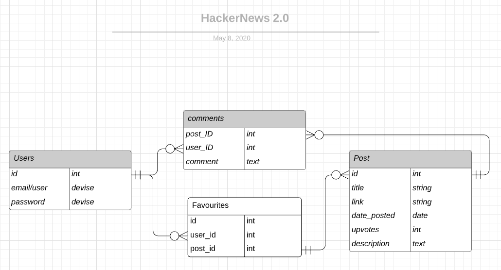

# HACKER NEWS 2.0/HACKATHON

### By: Jacob Colyvan, Ashley Bridges, Jeremy Wu

### Github Repositories: https://github.com/yeddyfit/railsHackathon 

### Website: https://hackernews2point0.herokuapp.com/

## Purpose

The purpose of this project, is to test our abillty to create a Web App in a hackathon with our recently developed Ruby on Rails skills. The team decided to recreate the website Hacker News (https://news.ycombinator.com/news) and make it more aesthetically pleasing, as the website current design/colour scheme was not great. It essentially makes call to the HackerNews API, and bundles it in a better looking skin.

## Features

The features of the website should contain posts which is acquired by the hacker news API, which users are allowed to sign up and log in to the site and comment on any of the posts which should display the users comments under the post.

## Entity Relationship Diagram

## Gems:

* httparty

* devise

## Tech Stack:

* Ruby version 2.7.0

* Rails version 5.2.4.2
